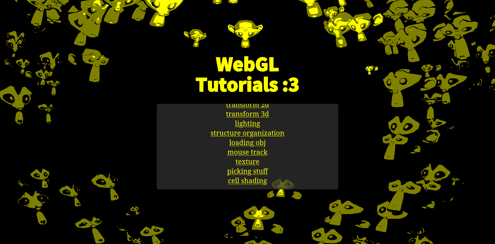

# webgl-tutorials
me learning webgl

## Setup
start a local server in the parent directory with:
```bash
python3 -m http.server 8000
```
to compile **one** of the multiple pages enter the directory
```bash
cd ./launchpage/.
```
and then run type script in that folder to convert all the `.ts` files into `.js` files
```bash
tsc
```
check on [localhost](http://localhost:8000/)
```bash
firefox localhost:8000
```

## Credits
most of the stuff here is just nearly a copy of the [WebGL Fundamentals](https://webglfundamentals.org/), which i replicated with my own boilerplate and in typescript